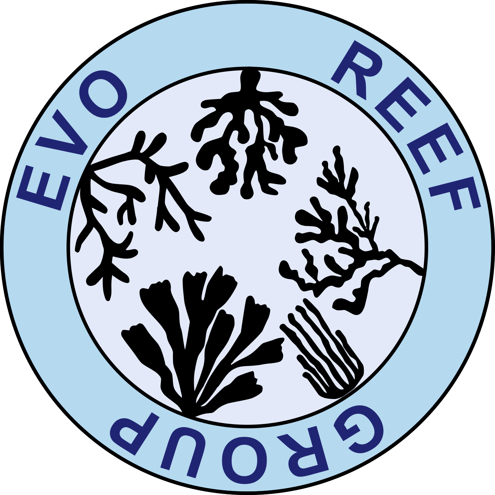

  

  # EvoReef Group

  **Evolutionary genomics of corals and other marine organisms**

---

## Who we are

The EvoReef group is an interdisciplinary team investigating eco-evolutionary processes in natural coral populations from the Great Barrier Reef using genetic and genomic data and associated physiological and environmental datasets, originally generated under Reef Restoration and Adaptation Project (RRAP) funding. This group includes researchers, students, technicians and project managers.

## Scientific mission

Our aim is to advance understanding of coral biology through the genetic lens to enhance the resilience of future coral reefs. We combine knowledge from physiology, evolutionary biology, ecology and use cutting-edge genomic analyses to advance understanding of coral adaptation and evolutionary resilience. The genomic data that we have and continue to collect and continue to produce provide a rich resource towards increasing fundamental knowledge and toinform strategies for reef restoration and genetic monitoring.

## Research themes

- **Population genomics** — population structure, genetic diversity, and gene flow across spatial scales
- **Thermal tolerance** — genomic and physiological basis of heat tolerance, dose-response modelling of thermal stress
- **Local adaptation** — environmental association analyses and signatures of selection
- **Conservation genomics** — application of evolutionary principles for reef conservation and restoration
- **Bioinformatics & pipeline development** — scalable genomics pipelines for non-model coral species (variant calling, GWAS, heritability)

## Repositories & pipelines

| Repository | Description | Status |
|---|---|---|
| `GATK+Parabricks` | Implementing Parabricks for GPU-accelerated genotype calling with GATK | active |
| `analysis-name` | One-line description of analysis repo | active / archived |

## People

- Cynthia Riginos (PI)
- Iva Popovic
- Zoe Meziere
- Lorenzo Bertola
- ADD YOUR NAME HERE

## Highlighted publications

- Denis et al. (2026) Holobiont population structure and adaptive potential of _Acropora spathulata_ [DOI/link](https://doi.org/10.1016/j.cub.2026.04.057)
- Meziere et al. (2025) Connectivity differs by orders of magnitude among co-distributed corals [DOI/link](https://doi.org/10.1126/sciadv.adt206)
- Riginos et al. (2024) Cryptic species and hybridisation in corals [DOI/link](https://doi.org/10.24072/pcjournal.492)
- Bairos-Novak et al. (2021) Meta-analysis of heritability of coral traits [DOI/link](https://doi.org/10.1111/gcb.15829)

## Contact & collaboration

Interested in collaborating, using our pipelines, or have questions about our work? Reach out via to our institutional emails (these can be found through our official institution pages).
